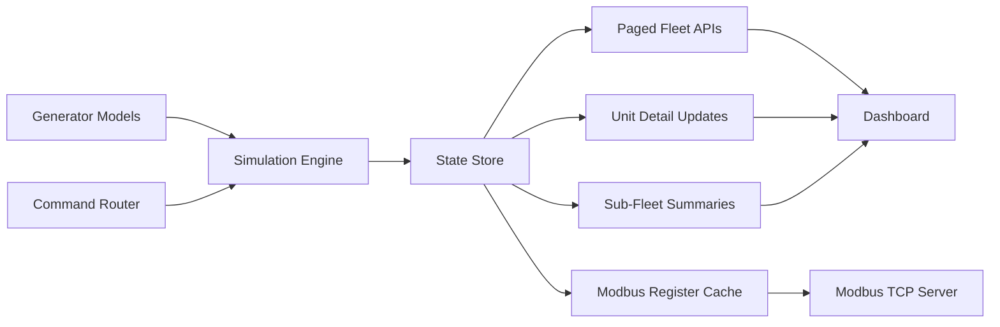

[](https://github.com/studioxvii/generator-fleet-simulator/actions/workflows/ci.yml)

# Generator Fleet Simulator Community Edition

Generator Fleet Simulator Community Edition is a free-to-download, MIT-licensed
standby generator fleet simulator built for large test scenarios. It scales the
original simulator model up to 2,000 generators in one instance and adds a
paged fleet dashboard, sub-fleet management, one-line SCADA drilldown,
per-unit Modbus inspection, and Socket.IO-driven live updates. Project source
code is licensed under MIT. Third-party components retain their own licenses;
see [THIRD_PARTY_NOTICES.md](THIRD_PARTY_NOTICES.md). The launcher ZIP is a
Docker startup bundle; this repository contains the source code.

This repository is intentionally separate from the original smaller simulator so the large-fleet product can evolve independently.

Release candidate `1.1.0-rc.5` contains the launcher and download fixes.
[Download the preview](https://github.com/studioxvii/generator-fleet-simulator/releases/tag/v1.1.0-rc.5).
The release page includes the signed Community Edition ZIP and verification files.
Extract the ZIP and follow the launcher instructions below. GitHub and Docker Hub
accounts are not required to download a published release. Native Windows Docker
Desktop and full clean-machine launcher acceptance remain pending.

The container uses Python 3.11 on Alpine Linux, pinned by image digest. It changes
the environment inside Docker, not your computer's operating system.
Run this simulator only locally or on an isolated LAN. See
[release readiness](https://github.com/studioxvii/generator-fleet-simulator/blob/main/docs/security-readiness-audit.md) for current limits.

## What This Simulator Does

- Simulates up to 2,000 generators in one process
- Exposes all 2,000 generators through Modbus TCP, with 255 generators per port
- Supports generator states `STOPPED`, `CRANKING`, `RUNNING`, `COOLDOWN`, and `FAULT`
- Supports transfer, parallel, and island operating modes
- Provides unit, fleet, and sub-fleet command paths
- Includes a browser dashboard for operations, filtering, paging, one-line SCADA navigation, and protocol inspection
- Exposes live per-unit register values, parallel setpoint control, and three alarm words
- Tracks runtime metrics such as tick duration, queue depth, Modbus sync time, and connected clients

## Dashboard Overview

After startup, the dashboard is organized into six tabs:

- `Fleet Status`: paged table, filters, bulk actions, scope-level operating mode controls, and pop-out unit detail modal
- `Sub-Fleets`: create, rename, delete, inspect, and operate named groups with a full-fleet builder workflow
- `One-Line SCADA`: fleet/sub-fleet/size/range/unit hierarchy drilldown with kW rollups, breaker status, fault/alarm visibility, breadcrumbs, and scoped controls
- `Scenario Timelines`: run built-in operating timelines and save reusable runbooks
- `Modbus Registers`: inspect one unit's live register map with raw values, scaling, engineering values, binary alarm words, and decoded active bits
- `How To Use`: guided operator workflow and Modbus usage notes

### Fleet Status Highlights

- Numbered pagination with `First`, `Prev`, `Next`, `Last`
- Page-size selector and direct `Go to page`
- Range display like `Showing 1451-1500 of 1500`
- Checkbox-based row selection
- Selection action bar for:
  - creating a sub-fleet from the current selection
  - assigning selected units to an existing sub-fleet
  - removing selected units from sub-fleets
  - switching selected units into `Transfer` or `Parallel` mode
- Fleet-wide top-bar controls for `Transfer Mode All` and `Parallel Mode All`
- Row click opens a pop-out generator detail modal

### Sub-Fleet Builder Highlights

- Designed for large fleets where operators should not have to navigate to a specific page to manage membership
- Search the full fleet by unit ID or generator name
- Filter candidate units by state, size, alarmed status, auto/manual mode, and membership state
- Assign all matching generators to the active sub-fleet in one action
- Paste direct unit IDs or ranges such as `200-240`
- Search and filter current members, then remove all matching members in one action
- Group-level controls for `Transfer Group` and `Parallel Group`

### Sub-Fleet Behavior

Sub-fleets are user-created. A newly started simulator session begins with no sub-fleets until the user creates them. The SCADA tab still groups unassigned units by generator size and unit ranges so large fleets remain navigable before operators create named groups.

Generator run hours and sub-fleet membership are saved in the simulator state volume. Starting a new configured session with a different fleet mix resets the runtime to the selected fleet.

## Quick Start

### Community Edition launcher (recommended)

For the free Community Edition package, start with the guided launcher instead
of a raw Docker command:

```bash
./start.sh
```

On Windows PowerShell:

```powershell
.\start.ps1
```

The launcher requires license display and security review before it starts
the container. It checks Docker, walks through each required setup step in
order, and asks whether the simulator should stay local-only or enter trusted
LAN integration mode for isolated test networks. For the normal download path,
the launcher also asks for a fleet mix, configures the simulator through the
startup API, and waits until Modbus is ready. Individual generator units start
in a ready/stopped state until the operator issues a start command, scenario,
runbook, or Modbus command from the dashboard or SCADA tab.

See [CUSTOMER_ONBOARDING.md](CUSTOMER_ONBOARDING.md) for the full first-run
flow and [WEBSITE_STARTUP_INSTRUCTIONS.md](WEBSITE_STARTUP_INSTRUCTIONS.md) for
website startup copy. Use [LAUNCH_CHECKLIST.md](https://github.com/studioxvii/generator-fleet-simulator/blob/main/LAUNCH_CHECKLIST.md)
before publishing a Community Edition release.

### Local development install and run

```bash
python3 -m venv .venv
source .venv/bin/activate
python3 -m pip install --require-hashes -r requirements-dev.lock
python3 -m pip install --no-build-isolation --no-deps -e .
python3 main.py
```

Then open [http://127.0.0.1:5000](http://127.0.0.1:5000).

No license acceptance environment variable is required.
After the web process starts, the simulator runtime does not start immediately.
First:

1. Choose how many generators you want at each size in the startup overlay
2. Click `Start Simulator`
3. The app will start the Modbus server and transition into the live dashboard

### Optional console entry point

```bash
generator-fleet-sim
```

### Production runtime

Local development can run `python3 main.py`, but packaged local or isolated-LAN deployments
should use the Gunicorn entry point in `wsgi.py` instead of Flask's development
server. The simulator keeps command queues, Socket.IO watches, Modbus context,
and generator state in one process, so production deployments must run exactly
one worker process with threads enabled:

```bash
GENSIM_WEB_HOST=0.0.0.0 \
GENSIM_WEB_PORT=5000 \
gunicorn --worker-class gthread --workers 1 --threads 100 --bind 0.0.0.0:5000 wsgi:app
```

The Docker image uses this Gunicorn configuration by default. Scale by running
separate simulator instances with separate ports and persistence files, not by
adding Gunicorn workers to one instance.

## Free Community Edition Docker Package

The Community Edition launcher starts Generator Fleet Simulator only.

### System requirements

- [Docker Desktop](https://docs.docker.com/get-docker/) (includes Docker Compose)
- macOS/Linux launcher: Bash, Python 3 (`python3`), and `curl`; Windows: PowerShell
- Docker access for the current account (`docker info` must succeed)
- Internet access to pull images from Docker Hub on first run
- A 64-bit `amd64` or `arm64` host supported by Docker
- Available local host ports `5001` and `5021–5028`, or alternate port mappings
- A current desktop browser for the dashboard
- The launcher ZIP, `.sha256` checksum, and release receipt supplied together

Published release images must be public and anonymously pullable. A Docker Hub
account or `docker login` is not part of the normal setup journey. Use the exact version and digest in the release receipt.

### Running the launcher

```bash
./start.sh
```

The script will:
1. Check that Docker is installed and running
2. Help the user install or start Docker when needed
3. Display the MIT License
4. Display the security notes and require acknowledgement
5. Ask for local-only or LAN network exposure
6. Ask for a default, custom, or browser-configured fleet mix
7. Pull the pinned public Generator Fleet image from Docker Hub
8. Start Generator Fleet Simulator
9. Configure the selected fleet mix from the terminal
10. Wait for simulator readiness, then print the access URLs

If Docker reports `pull access denied`, the public image or exact release tag
was not published correctly, or Docker Hub is unavailable. Retry after checking
internet and Docker status; if it persists, report the version and pull error
to Studio Seventeen. The `use` fallback is for a previously verified cached
copy of that exact pinned image.

Before first launch, verify the package checksum using the command in
`INSTALL.md`, then confirm that `VERSION`, the image digest in the release
receipt, and the version displayed on the download page agree.

### Accessing the simulator

| Service | Endpoint |
|---|---|
| Dashboard | http://localhost:5001 |
| Modbus TCP | localhost:5021–5028 |

### Managing the simulator

```bash
# View logs
docker compose logs -f generator

# Stop simulator (data is preserved)
docker compose stop generator

# Start again after stopping
SIM_HOST_BIND=127.0.0.1 docker compose up -d generator

# Stop and delete all data (clean slate)
docker compose down -v

# Pull the pinned image for this package and restart
SIM_HOST_BIND=127.0.0.1 docker compose pull
SIM_HOST_BIND=127.0.0.1 docker compose up -d generator
```

### Direct Docker startup

For automated environments only, you can bypass the interactive launcher after
reviewing the license and security notes:

```bash
SIM_HOST_BIND=127.0.0.1 docker compose up -d
```

## Release Integrity

Every tagged release candidate is built only after the locked install, test
suite, dependency audit, credential guard, source compilation, container
vulnerability gate, and 2,000-generator HTTP/Modbus smoke pass. The publish workflow then:

- pushes `linux/amd64` and `linux/arm64` images with BuildKit SBOM and max-level
  provenance attestations;
- signs the immutable image digest with GitHub Actions OIDC and verifies the
  signature before packaging;
- creates a deterministic launcher ZIP, SHA-256 checksum, release receipt, and
  downloadable SPDX JSON SBOM;
- signs and verifies a SHA-256 manifest covering the ZIP, checksum, receipt,
  and SBOM with a keyless Sigstore bundle;
- runtime-smokes and vulnerability-scans the exact pushed digest on `linux/amd64`
  and `linux/arm64`, then promotes it from an unadvertised candidate tag to the official tags;
- attaches the assets to a GitHub prerelease and retains them as workflow
  artifacts.

The receipt ties the Community Edition bundle to its release version, Git commit, image
repository and digest, dependency-lock hash, and workflow run. See
`RELEASE_PROCESS.md` for maintainer verification and publication steps.

Verify the release-asset manifest before running the launcher:

```bash
cosign verify-blob \
  --bundle generator-fleet-simulator-community-edition-v<VERSION>-SHA256SUMS.sigstore.json \
  --certificate-identity-regexp '^https://github.com/studioxvii/generator-fleet-simulator/.github/workflows/docker-publish.yml@refs/tags/v' \
  --certificate-oidc-issuer 'https://token.actions.githubusercontent.com' \
  generator-fleet-simulator-community-edition-v<VERSION>-SHA256SUMS
sha256sum --check generator-fleet-simulator-community-edition-v<VERSION>-SHA256SUMS
```

## Default Ports and Hosts

Local Python development defaults:

- Dashboard: `127.0.0.1:5000`
- Modbus TCP: `127.0.0.1:5020–5027` (only the ports needed by the fleet listen)

Community Edition Docker packages publish host ports to `127.0.0.1` by default through
the launcher and Compose files. Choose trusted LAN integration mode only when a
trusted HMI, SCADA workstation, or Modbus client on another machine needs to
connect from an isolated engineering or test network.

The Modbus endpoint is unauthenticated control traffic. Keep it on a trusted
network or use local-only binding. Set `GENSIM_MODBUS_HOST=0.0.0.0` only when
the simulator is protected by trusted-LAN firewall or VPN controls.

The dashboard, REST commands, Socket.IO commands, and Modbus commands do not
implement application authentication. The supported security boundary is the
default local-only host binding or an explicitly isolated trusted LAN. Do not
publish the simulator or Modbus port to the public internet.

## Privacy And Support Boundary

The simulator runs locally in Docker. It stores generator state, sub-fleets,
and saved runbooks in the local `generator-data` Docker volume. The application
does not include telemetry, analytics, user accounts, or a Studio
Seventeen-hosted backend. Docker itself contacts Docker Hub to download the
public image, and normal network/DNS logs may be retained by Docker or the
operator's environment under their policies.

Community Edition is supplied without an included support SLA. Use the
feedback/support link published beside the download to report reproducible
issues, and include the release receipt, version, platform, and relevant
container logs. Report security issues through the private process in
`SECURITY.md`.

## Environment Variables

| Variable | Default | Purpose |
|---|---|---|
| `GENSIM_NUM_GENERATORS` | `15` | Initial suggested total before startup configuration |
| `GENSIM_MAX_GENERATORS` | `2000` | Maximum generators allowed in one simulator instance |
| `GENSIM_WEB_HOST` | `127.0.0.1` | Web dashboard bind address |
| `GENSIM_WEB_PORT` | `5000` | Web dashboard port |
| `GENSIM_MODBUS_HOST` | `127.0.0.1` | Modbus TCP bind address |
| `GENSIM_MODBUS_PORT` | `5020` | First Modbus TCP port; up to eight consecutive ports |
| `GENSIM_PUBLIC_WEB_HOST` | request host | Hostname shown in dashboard connection hints |
| `GENSIM_PUBLIC_WEB_PORT` | request port | Web port shown in dashboard connection hints |
| `GENSIM_PUBLIC_MODBUS_HOST` | request host | Modbus host shown in dashboard connection hints |
| `GENSIM_PUBLIC_MODBUS_PORT` | `GENSIM_MODBUS_PORT` | Modbus port shown in dashboard connection hints |
| `GENSIM_STATE_FILE` | `generator_state.json` | Persisted runtime state file |
| `GENSIM_RUNBOOKS_FILE` | `generator_runbooks.json` | Persisted saved runbooks file |
| `GENSIM_SAVE_INTERVAL` | `60` | Seconds between periodic state saves |
| `GENSIM_TICK_SECONDS` | `1.0` | Simulation tick size |
| `GENSIM_HTTP_RATE_LIMIT` | `120` | Max mutating HTTP/Socket.IO commands per client per window; `0` disables |
| `GENSIM_HTTP_RATE_WINDOW` | `60` | Rate-limit window in seconds |

Example:

```bash
export GENSIM_MAX_GENERATORS=2000
export GENSIM_WEB_PORT=5001
export GENSIM_MODBUS_PORT=5021
python3 main.py
```

## Startup Notes and Troubleshooting

### Startup flow

The Community Edition launcher can start the selected fleet mix directly from the
terminal. If you choose to configure later, the startup overlay validates your
selected fleet mix before it attempts to launch the simulator runtime.

If startup fails, the overlay now keeps the page active, restores the button, and shows the server-side error message directly.

### Common startup failure

The most common startup failure is a stale Python process already holding the Modbus port.

Typical symptom:

- the dashboard loads
- clicking `Start Simulator` does not transition into the live fleet
- the startup overlay shows a port-unavailable error for `127.0.0.1:5020`

Fix:

1. Stop the old simulator process that is still bound to the Modbus port
2. Refresh the dashboard
3. Click `Start Simulator` again

If needed, use:

```bash
lsof -nP -iTCP:5020 -sTCP:LISTEN
```

## Architecture

The simulator keeps the large-fleet model in one process while separating responsibilities internally:

- `main.py`: app factory, runtime orchestration, APIs, command routing, state store, metrics, and event publishing
- `generator.py`: generator state machine, alarms, transfer behavior, and analog simulation
- `modbus_server.py`: Modbus datastore and TCP server wrapper

Runtime flow:



## HTTP API Surface

- Dashboard: `GET /`
- Fleet summary: `GET /api/fleet/summary`
- Paged fleet list: `GET /api/fleet/generators`
- Generator detail: `GET /api/generators/<unit_id>`
- Generator registers: `GET /api/generators/<unit_id>/registers`
- Sub-fleet management: `GET/POST/PATCH/DELETE /api/subfleets...`
- Metrics: `GET /api/metrics`
- Liveness: `GET /api/live`
- Readiness: `GET /api/ready`
- SCADA topology: `GET /api/scada/topology`
- SCADA alarms: `GET /api/scada/alarms`
- Startup endpoint: `POST /api/startup`
- Config export: `GET /api/export/config.csv`

## Modbus TCP Surface

- Host: `127.0.0.1` by default
- Base port: `5020` by default; up to eight consecutive ports (`5020–5027`)
- Wire unit IDs restart at `1` on each port after `255`
- Generator 256 uses port `5021`, unit `1`; generator 2000 uses port `5027`, unit `215`
- Compose publishes ports `5021–5028`; the Modbus tab and config export show each address
- For Compose: generator 255 = port `5021` / unit `255`; generator 256 = port `5022` / unit `1`; generator 2000 = port `5028` / unit `215`
- The host IP stays the same; dashboard/API generator IDs remain `1–2000`
- Some clients and gateways restrict unit IDs to 1–247; check the target client

For register definitions, alarm bitfields, command values, and client examples, see [MODBUS_REFERENCE.md](./MODBUS_REFERENCE.md).

## Development

Install dependencies and run tests:

```bash
python3 -m pip install --require-hashes -r requirements-dev.lock
python3 -m pip install --no-build-isolation --no-deps -e .
python3 -m pytest
```

When an abstract dependency range changes, regenerate both reviewed locks with
`pip-tools`, inspect the resolved diff, and rerun the full suite:

```bash
python3 -m pip install pip-tools
pip-compile --generate-hashes --strip-extras --no-emit-index-url --no-emit-trusted-host -o requirements.lock requirements.txt
pip-compile --allow-unsafe --generate-hashes --strip-extras --no-emit-index-url --no-emit-trusted-host -o requirements-dev.lock requirements-dev.txt
pip-compile --allow-unsafe --generate-hashes --strip-extras --no-emit-index-url --no-emit-trusted-host -o requirements-audit.lock requirements-audit.txt
```

If bytecode cache writes are a problem in a restricted environment:

```bash
PYTHONPYCACHEPREFIX=/tmp/pycache python3 -m py_compile main.py generator.py modbus_server.py runbooks.py scenarios.py
```

## Contributing

If you change user-visible behavior, update the docs in the same branch:

- `README.md` for workflow, startup, UI, and operational behavior
- `CUSTOMER_ONBOARDING.md` for the guided launcher flow
- `WEBSITE_STARTUP_INSTRUCTIONS.md` for website startup copy
- `OPERATIONS.md` for deployment, readiness, logs, and upgrade procedures
- `MODBUS_REFERENCE.md` for register map or protocol changes
- `CONTRIBUTING.md` for contributor workflow or expectations

## Separation From The Original Repo

This repository is the home of the scaled 2,000-generator simulator. The original `generator-simulator` repo remains the smaller fleet variant with its own UI and operating assumptions.

## Release readiness

See [release readiness](https://github.com/studioxvii/generator-fleet-simulator/blob/main/docs/security-readiness-audit.md) and the
[preview acceptance record](https://github.com/studioxvii/generator-fleet-simulator/blob/main/docs/releases/v1.1.0-rc.5-acceptance.md).
Public source and signed `1.1.0-rc.5` preview downloads are available.

Host validation accepts literal IP addresses and configured web host names.
Set `GENSIM_TRUSTED_HOSTS` to a comma-separated list of other exact DNS names
needed for an isolated LAN or same-origin proxy. This does not add authentication.
